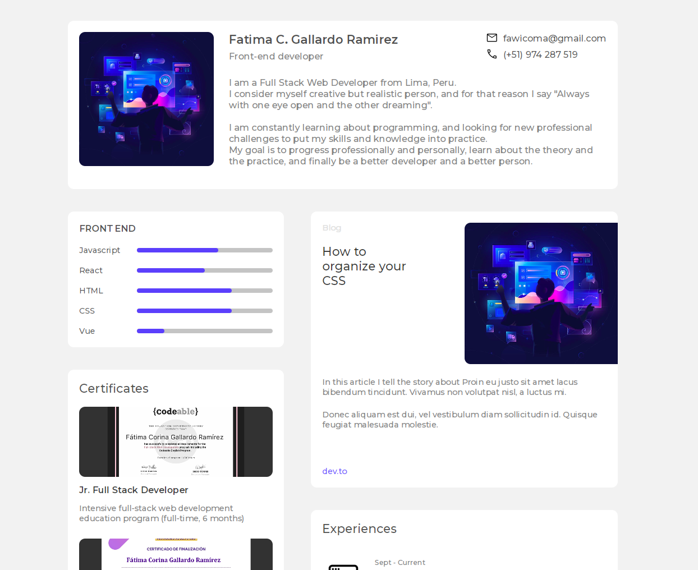

<!-- Please update value in the {}  -->

<h1 align="center">Portfolio</h1>

<div align="center">
   Solution for a challenge from  <a href="http://devchallenges.io" target="_blank">Devchallenges.io</a>.
</div>

<div align="center">
  <h3>
    <a href="https://{your-demo-link.your-domain}">
      Demo
    </a>
    <span> | </span>
    <a href="https://{your-url-to-the-solution}">
      Solution
    </a>
    <span> | </span>
    <a href="https://devchallenges.io/challenges/5ZnOYsSXM24JWnCsNFlt">
      Challenge
    </a>
  </h3>
</div>

<!-- TABLE OF CONTENTS -->

## Table of Contents

- [Overview](#overview)
  - [The challenge](#the-challenge)
  - [Built With](#built-with)
- [How to use](#how-to-use)
- [Contact](#contact)

<!-- OVERVIEW -->

## Overview



### The challenge

Create all the elements in the given designs and then create a portfolio with your own content. You can create your own layout. You can use React, Vue.js, or other libraries to create a reusable component, but it is not required. Fulfill user stories below:

- [✓] I can see personal details
- [✓] I can see skills
- [✓] I can see projects
- [✓] I can filter projects by tag
- [✓] I can see hobbies or certificates
- [✓] I can see experiences
- [✓] I can see blogs
### Built With

- CSS
- JavaScript
- React

<!-- THE CHALLENGE -->
## How To Use

<!-- Example: -->

To clone and run the following commands:

```bash
# Clone this repository
$ git clone https://github.com/FatimaGR/Portfolio-solution.git

# Install dependencies
$ npm install

# Run the app
$ npm run dev
```

## Contact

- Website - [Fatima Gallardo](https://porfolio-website-gules.vercel.app)
- GitHub - [@FatimaGR](https://github.com/FatimaGR)
- Dev challenges - [@FatimaGR](https://devchallenges.io/portfolio/FatimaGR)